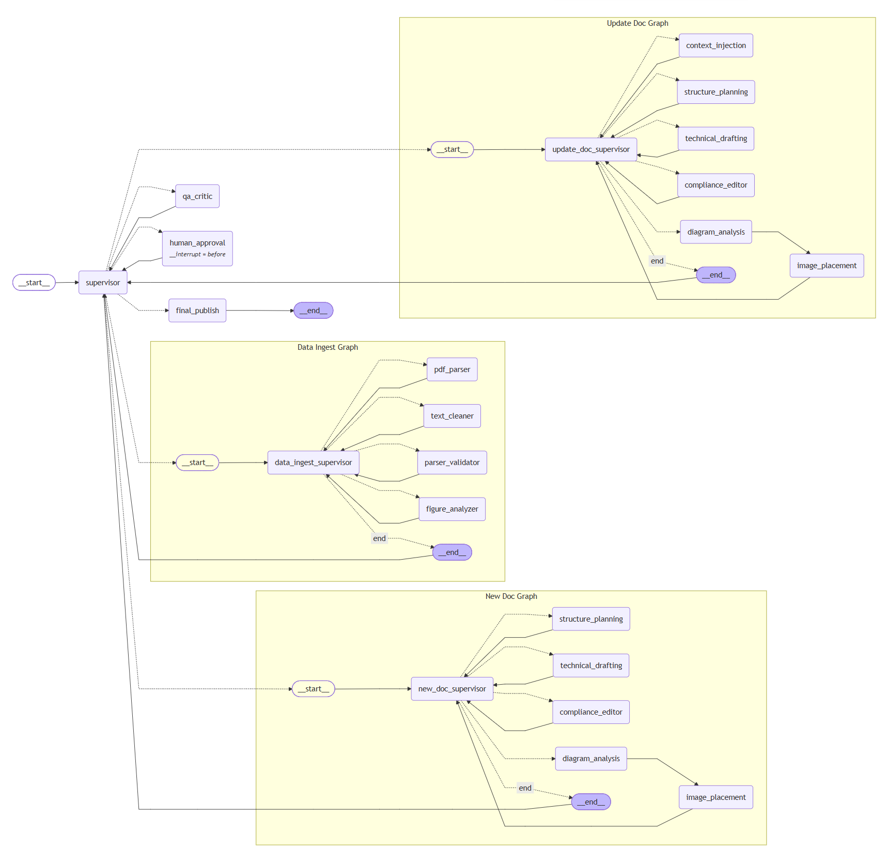
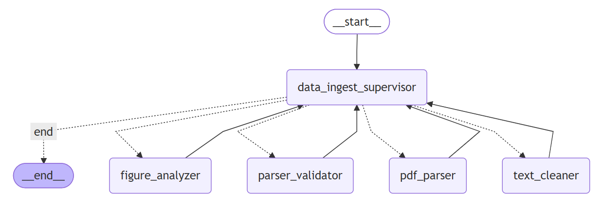
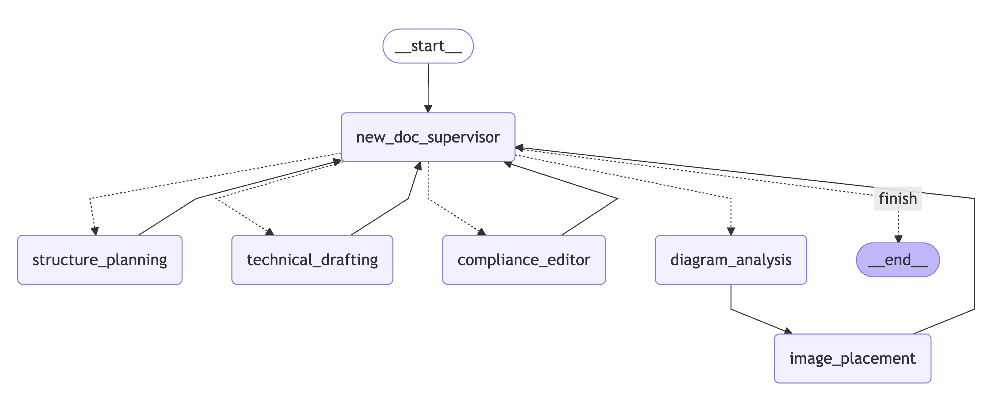
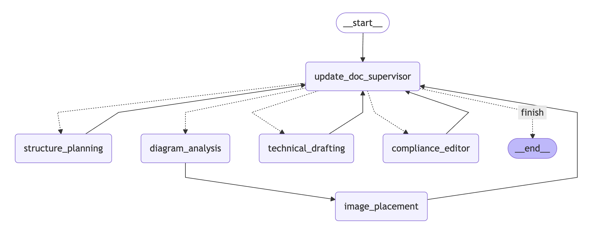

# AutoDoc-MAS

> LangGraph 기반 멀티 에이전트 기술 문서 자동화 시스템



<!-- 데모 GIF 자리 -->
<!--  -->
---

## 개요

AutoDoc-MAS는 개발 과정에서 발생하는 비정형 기술 데이터(코드 스니펫, 회의록, PDF 기술 문서, 아키텍처 다이어그램 등)를 규격화된 기업용 기술 문서로 변환하고 관리하는 **LangGraph 기반 멀티 에이전트 시스템(MAS)** 입니다.

단일 LLM 호출에 의존하지 않고, 이전 문서의 맥락 인지와 사내 가이드라인 준수 여부를 **다중 에이전트 간의 상호 검증(Reflection) 루프**를 통해 제어함으로써 기술 문서의 논리적 정합성을 확보합니다.

---

## 프로젝트 배경 및 동기

### 문제 정의

소프트웨어 아키텍처와 코드는 지속적으로 변경되지만, 이를 반영한 기술 문서화 작업은 유지보수 비용 문제로 인해 동기화가 지연되는 경우가 많습니다. 기존의 단일 LLM이나 단순 검색 증강 생성(RAG) 기법을 도입할 경우, 시스템 규모가 커질수록 기존 문서와의 **맥락 단절(Context Loss)** 이나 **기술적 환각(Hallucination)** 현상이 발생하여 실무 적용에 한계가 존재합니다.

### 해결 방안

본 프로젝트는 문서화 워크플로우를 **기획(Planner) -> 작성(Executor) -> 검증(Critic)** 역할로 분리한 멀티 에이전트 아키텍처를 채택했습니다. 시스템 내부에 독립적인 피드백 루프를 구축하여 사내 기술 표준을 강제하고, 사람의 개입을 최소화한 상태에서 신뢰도 높은 기술 문서를 자동 갱신할 수 있는 파이프라인을 설계했습니다.

---

## 시스템 아키텍처

메인 Supervisor를 중심으로 한 **계층형 멀티 에이전트 구조**를 채택하여 복잡한 문서화 공정을 자동화합니다. 전체 워크플로우는 1개의 메인 그래프와 3개의 서브 그래프로 구성됩니다.

### 0. Data Ingest Graph (데이터 전처리 파이프라인)

문서 작성 전, 입력 데이터의 형식을 통일하고 품질을 검증합니다.

- **PDF Parser (`pdf_parser`):** **Upstage Document Parse** API를 호출하여 PDF를 HTML 구조로 변환합니다.
- **Figure Analyzer (`figure_analyzer`):** PDF에서 추출된 figure/chart 이미지를 Vision LLM으로 분석하여 텍스트로 변환, `technical_source`에 병합합니다.
- **Text Cleaner (`text_cleaner`):** 텍스트 입력의 노이즈(연속 줄바꿈, 불필요한 공백)를 제거합니다.
- **Parse Validator (`parse_validator`):** 전처리 결과의 최소 품질 기준(빈 문자열, 인코딩 깨짐)을 검증합니다.

<br>



### 1. New Doc Graph (신규 문서 파이프라인)

새로운 시스템이나 마이크로서비스에 대한 최초 기술 문서 작성을 담당합니다.

- **Planner (`structure_planning`):** 입력된 기술 소스를 분석하여 문서의 아웃라인 구조를 설계합니다.
- **Executor (`technical_drafting`, `diagram_analysis`):** 아웃라인에 기반하여 초안을 작성하고, Vision 데이터를 분석해 최적의 위치에 이미지를 배치합니다.
- **Critic (`compliance_editor`):** 사내 표준 규격 준수 여부와 기술적 오류를 검토 및 윤문합니다.

<br>



### 2. Update Doc Graph (업데이트 문서 파이프라인)

기존 문서의 맥락을 유지하며 시스템 변경 사항을 반영하는 파이프라인입니다.

- **Context Loader (`context_injection`):** VectorDB에서 이전 문서의 핵심 용어와 결론을 로드하여 맥락을 주입합니다.
- **Planner (`update_structure_planning`):** 주입된 맥락과 신규 변경 사항을 결합하여 업데이트된 아웃라인을 기획합니다.
- **Executor (`update_technical_drafting`, `update_diagram_analysis`):** 이전 서사를 유지하며 변경된 기술 내용을 본문에 반영합니다.
- **Critic (`update_compliance_editor`):** 기존 문서와의 용어 통일성 및 업데이트 내용의 정합성을 최종 검증합니다.

<br>



---

## 핵심 기술 및 엔지니어링 포인트

### 1. LangGraph 기반 오케스트레이션

순차적인 체인 구조의 한계를 넘어, `StateGraph` 위에서 에이전트들이 협업하는 **순환형 계층 구조**를 설계했습니다.

- **Supervisor Agent:** 전체 워크플로우의 상태(TechDocState)를 평가하고 조건부 엣지(Conditional Edges)를 통해 최적의 노드로 동적 라우팅을 수행합니다.
- **계층형 서브 그래프:** 메인 그래프 아래 Data Ingest / New Doc / Update Doc 3개의 독립 서브 그래프를 분리하여 각 공정의 책임을 명확히 구분했습니다.

### 2. PDF Vision 분석 파이프라인

단순 텍스트 추출을 넘어 PDF 내 시각 데이터까지 문서화에 활용합니다.

- Upstage Document Parse API의 `base64_encoding` 옵션으로 figure/chart 이미지를 추출합니다.
- Multi-modal LLM이 각 이미지를 분석하여 수치, 구성 요소, 데이터 흐름을 구조화된 텍스트로 변환합니다.
- 변환된 텍스트는 `technical_source`에 병합되어 이후 문서 초안 작성의 기초 자료로 활용됩니다.

### 3. Long-term Memory 관리 전략

ChromaDB를 연동하여 프로젝트 단위의 **문서 네임스페이스**를 구축했습니다.

- **맥락 인지:** 과거 버전에 기록된 기술 개념과 결론을 VectorDB에서 검색 및 주입하여, 중복 서술을 방지하고 시스템 히스토리를 유지합니다.
- **메타데이터 압축:** 문서 발행 시 전체 텍스트가 아닌 핵심 키워드와 가이드라인 준수 사항만 메타데이터로 요약 저장하여 검색 효율을 높입니다.

### 4. Reflection

Critic 에이전트의 검증을 통과하지 못할 경우(`REVISE`), 피드백 내용을 Executor 에이전트에게 반환합니다. 무한 루프 방지를 위해 최대 수정 횟수 제한(`max_revisions`)을 두어 파이프라인의 안정성을 보장합니다.

### 5. Human-in-the-loop 제어
- 최종 문서 발행 전, 시스템이 대기 상태(Interrupt)로 전환되어 사용자가 직접 검토하고 수정안을 상태에 반영할 수 있는 인터페이스를 제공합니다.

---


## 데모

### 신규 문서 생성 (New Doc Pipeline)
<!--  -->
> 🎬 GIF 촬영 예정 — 비정형 기술 데이터 입력 → 아웃라인 설계 → 초안 작성 → QA → 최종 발행

### 업데이트 문서 생성 (Update Doc Pipeline)
<!--  -->
> 🎬 GIF 촬영 예정 — 기존 문서 맥락 주입 → 변경 사항 반영 → 정합성 검증 → 최종 발행

### PDF Figure Vision 분석
<!--  -->
> 🎬 GIF 촬영 예정 — PDF 업로드 → figure/chart 추출 → Vision LLM 분석 → technical_source 병합

---


## 기술 스택

| 분류 | 기술 |
|---|---|
| **Framework** | LangChain, LangGraph |
| **LLM** | Google Gemini 3.1 Series |
| **Document Parsing** | Upstage Document Parse API |
| **Database** | ChromaDB (Vector Store), SQLite |
| **Frontend** | Streamlit |
| **Language** | Python 3.10+ |

---

## 정량적 성과 지표

> ⚠️ 아래 수치는 `test_data/Payment-Gateway` 데이터셋 기반 측정값입니다.
> 비교 기준: 단일 LLM 직접 호출(Single-shot) 방식 대비

<!-- [TODO: 막대 그래프 이미지 첨부] -->
<!--  -->

| 지표 | 측정 내용 | 결과 |
|---|---|---|
| **환각 및 규격 위반 감소** | Critic 에이전트 자가 수정(Reflection) 루프 도입 전후 비교 | 🔲 측정 예정 |
| **토큰 소모량 최적화** | VectorDB 컨텍스트 주입 적용 전후 전체 토큰 사용량 비교 | 🔲 측정 예정 |
| **처리 시간** | 문서 1건당 E2E 처리 시간 (아웃라인 → 초안 → 윤문) | 🔲 측정 예정 |

---

## 프로젝트 구조

```text
AutoDoc-MAS/
├── Dockerfile                                      # Docker 이미지 빌드 설정
├── docker-compose.yml                              # 컨테이너 오케스트레이션 설정
├── .devcontainer/
│   └── devcontainer.json                           # VSCode Dev Container 설정
├── app.py                                          # Streamlit 웹 UI 진입점
├── requirements.txt                                # 패키지 의존성
├── assets/
│   └── images/                                     # 워크플로우 다이어그램 및 데모 GIF
├── test_data/
│   └── Payment-Gateway/                            # 파이프라인 E2E 검증용 모의 데이터
├── docs/                                           # 프로젝트 설계 가이드 문서
│   ├── 01_project_milestone.md                     # 개발 마일스톤 및 진행 현황
│   ├── 02_branch_guide.md                          # Git 브랜치 전략
│   ├── 03_commit_message_guide.md                  # 커밋 메시지 컨벤션
│   └── 04_prompt_guide.md                          # RISEN 기반 에이전트 프롬프트 가이드라인
└── src/
    ├── state.py                                    # 공유 상태(TechDocState) 스키마 정의
    ├── memory.py                                   # ChromaDB 초기화 및 컨텍스트 관리 로직
    ├── utils.py                                    # LLM 인스턴스, 유틸리티 함수
    ├── graphs/
    │   ├── main_graph.py                           # 메인 StateGraph 및 워크플로우 정의
    │   └── sub_graphs/
    │       ├── data_ingest_graph.py                # 데이터 전처리 서브 그래프
    │       ├── new_doc_graph.py                    # 신규 문서 서브 그래프
    │       └── update_doc_graph.py                 # 업데이트 문서 서브 그래프
    └── nodes/
        ├── main_node.py                            # Supervisor / QA Critic / HITL / Final Publish
        └── sub_graph_nodes/
            ├── data_ingest_graph_node.py           # 데이터 전처리 파이프라인 노드
            ├── new_doc_graph_node.py               # 신규 문서 파이프라인 노드
            ├── update_doc_graph_node.py            # 업데이트 문서 파이프라인 노드
            └── common_node.py                      # 공통 노드 (다이어그램 분석)
```

## 실행 방법

### 환경 변수 설정

```bash
cp .env.example .env
# .env 파일에 API 키 입력
```

```env
GOOGLE_API_KEY=your_google_api_key
UPSTAGE_API_KEY=your_upstage_api_key
```

### Docker (권장)

```bash
git clone https://github.com/taejung3852/AutoDoc-MAS.git
cd AutoDoc-MAS

# 이미지 빌드 및 컨테이너 실행
docker-compose up --build

# 백그라운드 실행
docker-compose up --build -d

# 컨테이너 중지
docker-compose down
```

### 로컬 직접 실행

```bash
git clone https://github.com/taejung3852/AutoDoc-MAS.git
cd AutoDoc-MAS
pip install -r requirements.txt

# Streamlit UI
streamlit run app.py
```